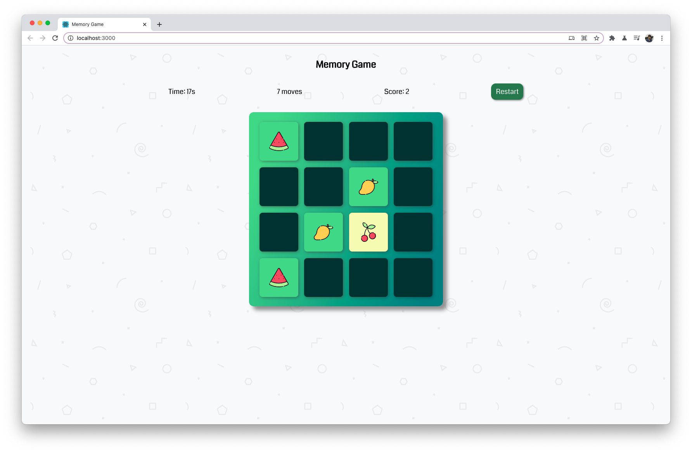
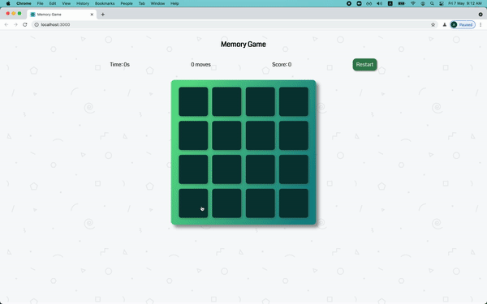
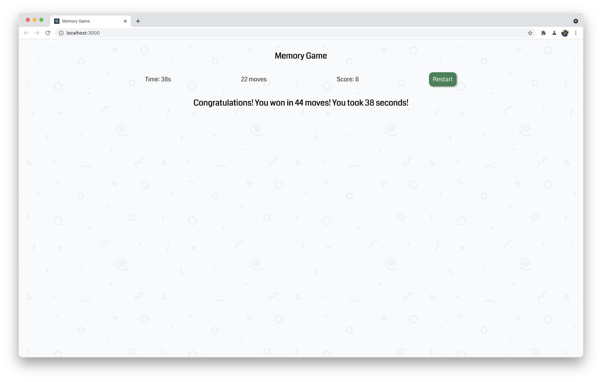

# Memory Game with React

Game finished:

## Colors
- Primary: rgba(96,221,142,1)
- Secondary: rgba(24,138,141,1)
- Gradient from [GradientHunt](https://gradienthunt.com/gradient/22202)

## Steps
You need to break this project into steps and list them down here...

### Edge cases
- Clicking on the same tile twice
- Clicking on another tile while two tiles that you have selected are visible